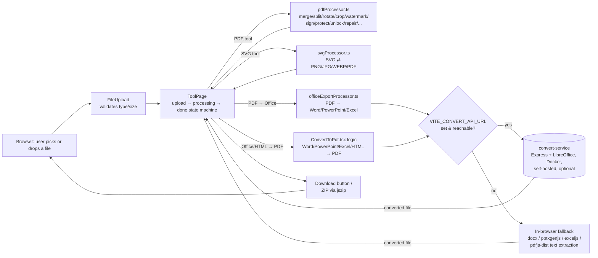

# Architecture

[← README](../README.md) · [User Guide](USER_GUIDE.md) · [Developer Guide](DEVELOPER_GUIDE.md)

Toolkit is a client-side single-page app: a React tool grid routes to per-tool
pages, each of which hands the user's file to a pure processing function and
gets a `Blob` back. Nothing is uploaded anywhere by default. The one
optional exception is Office↔PDF conversion, which can call an opt-in,
self-hosted LibreOffice service for higher fidelity, falling back to
in-browser processing if that isn't configured.

## Request/data flow



Every arrow into `TP` (ToolPage) after processing carries a `Blob`, never a
file path or server reference — the only network hop in the whole diagram is
the dashed opt-in path through `convert-service`, and that service deletes
its temp files immediately after responding (see [`convert-service/index.js`](../convert-service/index.js)).

## Project structure

```
src/
  App.tsx                 Router root (BrowserRouter, basename="/toolkit")
  components/              Shared UI: FileUpload, Header, Footer, ToolCard,
                            FormatSelect, ProgressBar, ScrollToTop, ParticleBackground
  hooks/
    useTheme.tsx           Light/dark theme, persisted to localStorage
    useGoBack.ts
  pages/
    HomePage.tsx            Tool grid, search, category tabs
    ToolPage.tsx             Generic upload → processing → done state machine
                             shared by almost every tool page
    ToolRouter.tsx           Maps a tool's URL id to its page component
    tool-pages/*.tsx         Mostly a thin wrapper per tool: a processor()
                             function passed into <ToolPage>. ScanToPdf.tsx is
                             standalone (camera capture, no file upload).
  utils/
    pdfProcessor.ts          Core PDF logic - unit tested (tests/pdfProcessor.test.ts)
    svgProcessor.ts          SVG ⇄ raster conversion
    officeExportProcessor.ts PDF → Word/PowerPoint/Excel extraction + generation
  data/
    tools.ts                 Tool registry: id, name, category, icon,
                             comingSoon / improving flags

convert-service/    Optional Node/Express + LibreOffice microservice (Docker)
tests/              Vitest suite (Node environment)
docs/               This documentation
```

Registering a new tool touches four files: `src/data/tools.ts`, a processor
in `src/utils/`, a wrapper in `src/pages/tool-pages/`, and a route entry in
`src/pages/ToolRouter.tsx`. See [`CLAUDE.md`](../CLAUDE.md) for the exact
steps if you're adding one.

## Non-obvious design decisions

- **Raster→SVG is not vector tracing.** `imageToSvg` in [`svgProcessor.ts`](../src/utils/svgProcessor.ts)
  wraps a PNG/JPG as a base64 `<image>` inside an SVG container at native
  pixel size. This preserves exact position/size without a tracing
  dependency, but the output isn't editable as paths.
- **Scan to PDF is the one tool that doesn't use `ToolPage`.** It needs a live
  `getUserMedia` camera preview, per-shot capture, and page reordering before
  anything is processed — none of which fits the upload-first state machine —
  so [`ScanToPdf.tsx`](../src/pages/tool-pages/ScanToPdf.tsx) owns its own
  capture → processing → done flow and calls `scanToPdf` in `pdfProcessor.ts`.
  A file picker (`<input capture>`) is offered as a fallback for devices with
  no camera or blocked permission.
- **The progress bar is simulated, not measured.** `ToolPage.tsx` advances
  progress with a `setInterval` tick while `processor()` runs, then jumps to
  100% on completion — there's no byte-level progress signal to hook into
  since processing happens in-memory, synchronously, in one call.
- **`comingSoon` vs `improving` are both honesty flags, not a generic
  work-in-progress marker.** `comingSoon` renders a "not available yet" page
  instead of a broken one; `improving` means the tool works today but only
  at basic (text-only, no fonts/images/layout) fidelity while a higher-
  fidelity path is being built — both are surfaced as UI badges
  (`ToolCard.tsx`) so the state is visible before a user clicks in.
- **The LibreOffice service is entirely optional and stateless.** Without
  `VITE_CONVERT_API_URL` set, every conversion still works, just via
  in-browser text extraction instead of full-fidelity rendering. PDF→Excel
  always uses the local path regardless of configuration — LibreOffice has
  no PDF import filter for Calc (`convert-service/index.js`, `SUPPORTED_TARGETS`).
- **The `pdfjs-dist` worker is served locally, not from a CDN**, at
  `${import.meta.env.BASE_URL}pdf.worker.min.mjs`, so it resolves correctly
  under the `/toolkit/` GitHub Pages base path in production.
- **`tools.ts`'s `category` field is the actual grouping used on the
  homepage and in the header nav** — e.g. QR Code is categorized `convert`
  in the data, so it appears under "Convert PDF" in the UI even though it's
  themed as a "PDF Intelligence" feature in copy elsewhere.

## Backend history

There is no backend today. `officeExportProcessor.ts`'s comment ("replaces
the old Supabase Edge Function") and the `feat: remove Supabase backend`
commit are the only remaining trace of a prior architecture that called a
Supabase Edge Function for PDF→Office conversion; that path has been fully
replaced by in-browser extraction/generation plus the optional self-hosted
`convert-service`.
