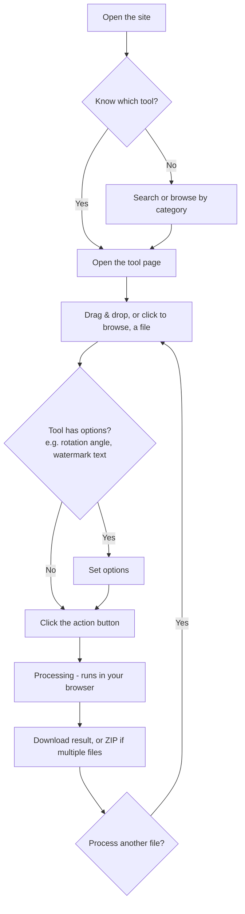

# User Guide

[← README](../README.md) · [Architecture](ARCHITECTURE.md) · [Developer Guide](DEVELOPER_GUIDE.md)

Toolkit is a free, browser-based PDF/image/SVG toolkit at
**[ahmednassar7.github.io/toolkit](https://ahmednassar7.github.io/toolkit/)**.
No sign-up, no upload — every tool processes your file locally in your
browser tab.

## Typical flow

## Finding a tool

- **Search** — the search box on the homepage filters by tool name and
  description as you type.
- **Category tabs** — "All Tools", Organize, Optimize, Convert, Edit,
  Security (the header nav links to these five; a sixth homepage section,
  PDF Intelligence, is reachable from the homepage grid or search but isn't
  in the top nav).
- **Tool badges** — a tool card can show:
  - **Coming Soon** — not implemented yet. Clicking it shows an honest "not
    available yet" page instead of pretending to process your file.
  - **Upgrading** — works today, but only at basic fidelity (plain text,
    no original fonts/images/layout) while a higher-fidelity version is
    being built. You'll see the same note again on the tool's own page
    before you upload anything.
  - No badge — fully implemented.

## Using a tool

1. Open a tool from the grid or search results.
2. **Upload a file** — drag and drop onto the upload area, or click it to
   browse. Most tools accept one file at a time; a few (Merge PDF, JPG to
   PDF) accept multiple files, up to 20. There's a 100MB-per-file limit, and
   only the file types listed under the upload box are accepted — anything
   else is rejected with an inline error before you can proceed.
3. **Set options**, if the tool has any (e.g. rotation angle, watermark
   text/color/opacity, output image format). These appear right below the
   upload area.
4. **Run it** — click the button (labeled with the tool's name). A progress
   indicator shows while it processes; this all happens in your browser, so
   larger files take longer but nothing leaves your device.
5. **Download the result.** A single output shows one download button. For
   tools that emit multiple files (like Split PDF), you get a "Download All"
   button plus a "Download as ZIP" option (built client-side with `jszip`).
   Click "Process Another" to start over without reloading the page.

## Other things worth knowing

- **Dark mode** — the sun/moon icon in the header toggles it; your choice is
  remembered (and otherwise follows your OS setting on first visit).
- **Privacy note on every result screen** confirms your file was processed
  entirely in your browser and never uploaded — that's true for every tool
  except the specific case below.
- **The one exception: Office ↔ PDF conversions** (PDF to/from Word,
  PowerPoint, Excel; Word/PowerPoint/Excel/HTML to PDF). If the site you're
  using has an optional self-hosted conversion server configured, your file
  is sent there for a higher-fidelity result (real fonts, images, tables,
  slide layouts) and deleted immediately after. If it's not configured
  (the default, unless someone has deployed and wired up their own — see the
  [Developer Guide](DEVELOPER_GUIDE.md#optional-convert-service)), those same
  conversions still work, just via lower-fidelity, purely in-browser text
  extraction — you'll see which method was used in the result screen's
  "method" stat tile.
- **PNG/JPG → SVG isn't vector tracing.** It wraps the raster image inside an
  SVG container at its original size — useful for embedding in SVG-only
  pipelines, but the result isn't editable as vector paths.
